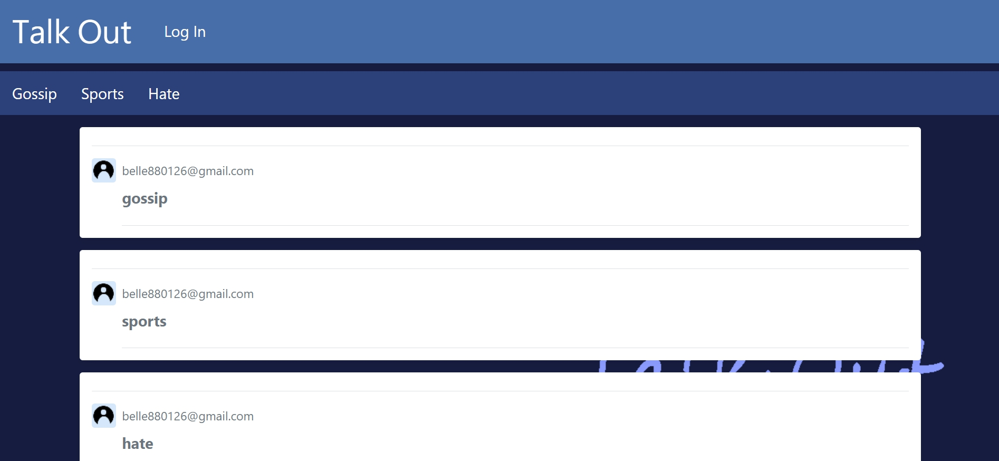

# Software Studio 2019 Spring Midterm Project

## Talk Out Forum
### By 張子宜

# 作品網址：https://forummmm-6bc9d.firebaseapp.com

# Components Description : 
1. 主頁: 可瀏覽所有文章，不分類別
2. Sign In : 登入、用google登入、創新帳號
3. Register : 創建新帳號，會進行密碼的確認
4. 三版：Gossip,Sports,Hate，可版上留言，文章分門別類
5. Log out：登出

# Other Functions Description : 
1. Animation : 標題動畫
2. User Pate : 點進去標題旁的信箱帳號，即可看到使用者頁面
3. Sign in with google : 登入時可選擇用google帳號登入

</img>
[]!image(forum.jpg)
